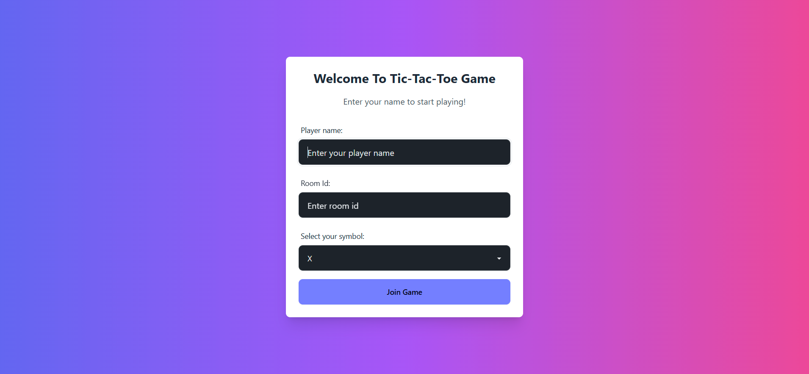

# Tick-Tack-Toe Game (Real-time)

A real-time multiplayer Tic-Tac-Toe game built with React, Socket.IO, Express, and MongoDB. Players can join a game room, make moves, and see each other's moves in real-time. The game ends when a player wins, or when it results in a tie.

## Features

- Real-time multiplayer using Socket.IO
- Dynamic grid updates with React
- Winner and Tie detection
- Player turn management
- Play again feature
- Attractive UI with Tailwind CSS

## Tech Stack

- **Frontend**: React, Tailwind CSS, DaisyUI
- **Backend**: Express, Socket.IO
- **Database**: MongoDB with Mongoose
- **Other**: Zustand for state management

## Screenshots

Here are some screenshots of the game:

*Game room joining form*
